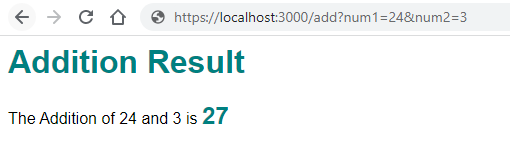
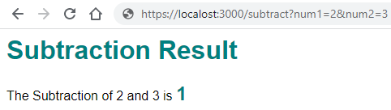
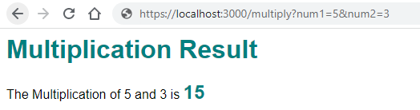
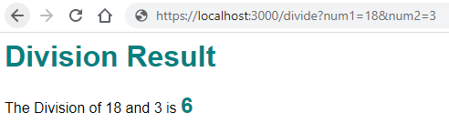
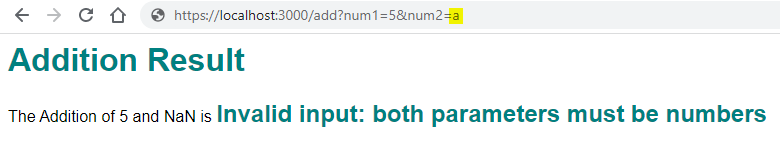

# Calculator Microservice

A simple microservice that performs basic arithmetic operations on two numbers.

## Usage

The microservice provides the following endpoints:

- `/add`: Adds two numbers.
- `/subtract`: Subtracts two numbers.
- `/multiply`: Multiplies two numbers.
- `/divide`: Divides two numbers.

### `/add`

URL: `/add?num1=[number]&num2=[number]`

Performs an addition operation on `num1` and `num2`.

#### Parameters

| Name  | Type   | Description             |
|-------|--------|-------------------------|
| `num1` | number | The first number to add. |
| `num2` | number | The second number to add. |

#### Response

Returns an HTML page with the result of the addition operation.

### `/subtract`

URL: `/subtract?num1=[number]&num2=[number]`

Performs a subtraction operation on `num1` and `num2`.

#### Parameters

| Name  | Type   | Description                |
|-------|--------|----------------------------|
| `num1` | number | The number to subtract from. |
| `num2` | number | The number to subtract.     |

#### Response

Returns an HTML page with the result of the subtraction operation.

### `/multiply`

URL: `/multiply?num1=[number]&num2=[number]`

Performs a multiplication operation on `num1` and `num2`.

#### Parameters

| Name  | Type   | Description             |
|-------|--------|-------------------------|
| `num1` | number | The first number to multiply. |
| `num2` | number | The second number to multiply. |

#### Response

Returns an HTML page with the result of the multiplication operation.

### `/divide`

URL: `/divide?num1=[number]&num2=[number]`

Performs a division operation on `num1` and `num2`.

#### Parameters

| Name  | Type   | Description                |
|-------|--------|----------------------------|
| `num1` | number | The number to divide.       |
| `num2` | number | The number to divide by.    |

#### Response

Returns an HTML page with the result of the division operation.

## Demonstration

## Credits

By Rohit Bajaj
StudentID - 221036191
